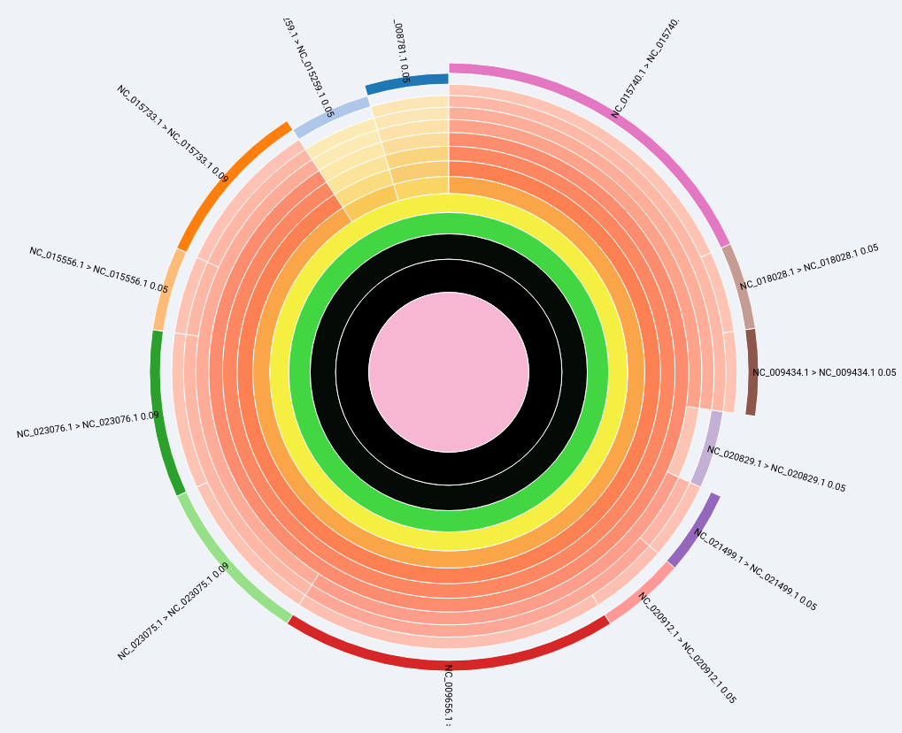
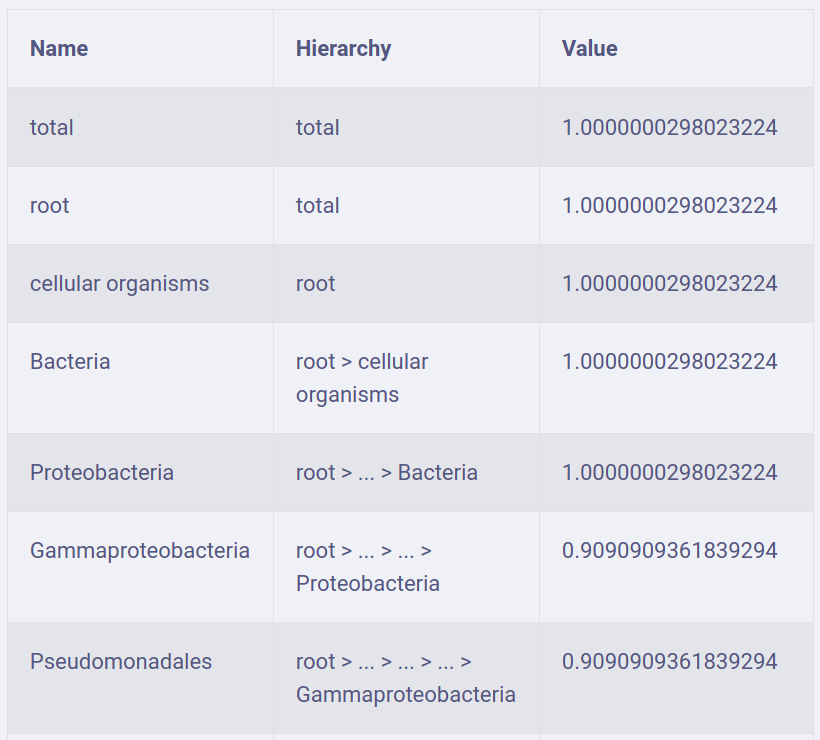

# Nanostream management application

Nanostream management application is designed to run/stop previously deployed dataflow templates.

You can access it by url: `https://<your project id>.appspot.com`

## New Pipeline screen

To create and run a new pipeline fill form fields:

- Pipeline Name - an arbitrary name to identify your pipeline.
- Input Folder - a folder in your upload bucket, a place for your input data.
- Pipeline Type - select appropriate value: "species" or "resistance_genes".
- Auto-stop - number of seconds no new files added to the pipeline to stop.
- Auto-start checkbox - pipeline starts if a data uploaded to Input Folder.
- Start immediately checkbox - start pipeline right after START button pressed.
- Reference databases block:
  - database name - a name to identify your database;
  - reference database uri - path to your FASTA file like: `gs://<your project id>-reference-db/db1/DB_viruses_12345678.fasta`;
  - taxonomy file uri - path to your taxonomy file like: `gs://<your project id>-reference-db/taxonomy/species_tree.txt` 

## Available Pipelines list screen

Contains list created pipelines. Consists of a table with columns:

- Name - pipeline name
- Input folder - your pipeline input folder	
- Output collection name prefix - Firestore collection prefix to output results	
- Processing mode - pipeline processing mode                                                               
- Input data subscription - a link to corresponding GCP subscription bounded to pipeline
- Jobs - list GCP dataflow jobs 
- Created at - when pipeline was created
- Status - current pipeline status
- Autostart - a checkbox to set pipeline autostart property
- Remove - a button to remove pipeline (just remove pipeline info created at "New Pipeline" screen; no uploaded data removed)

## Available Jobs list screen

Contains list CGP dataflow jobs. Columns:
- Name - job name
- Start time - when job started
- Stop time - when job stopped (for not running jobs)
- Current state - job state
- Stop - a button to cancel job   

## Pipeline details screen

Contains reference to pipeline info.

When some data saved to Firestore database you can see them on a chart or a table:

Each input data folder corresponds a result file in a Firestore collection. You can choose it in a dropdown.   

 
