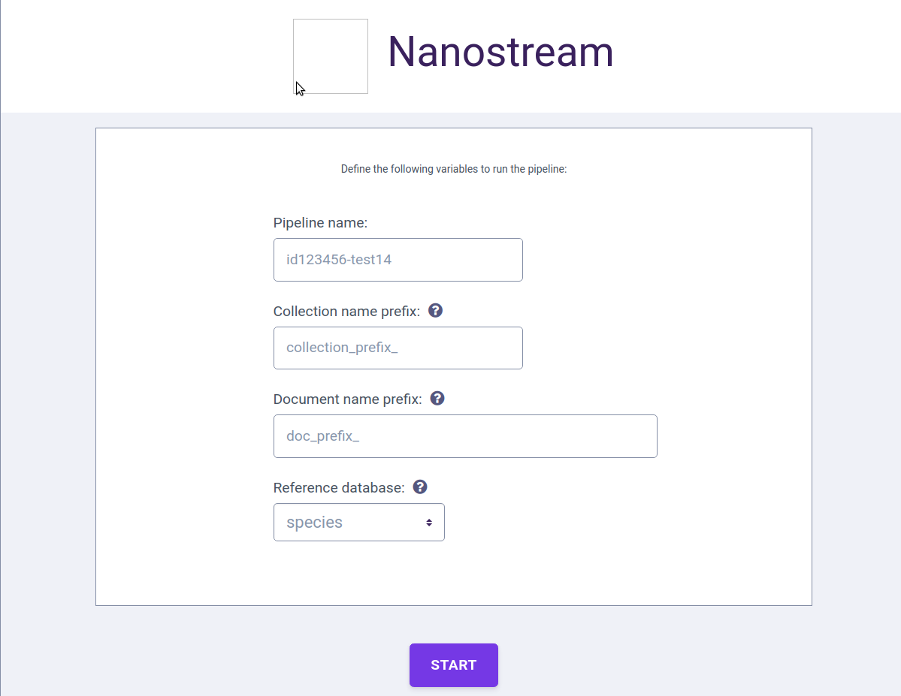
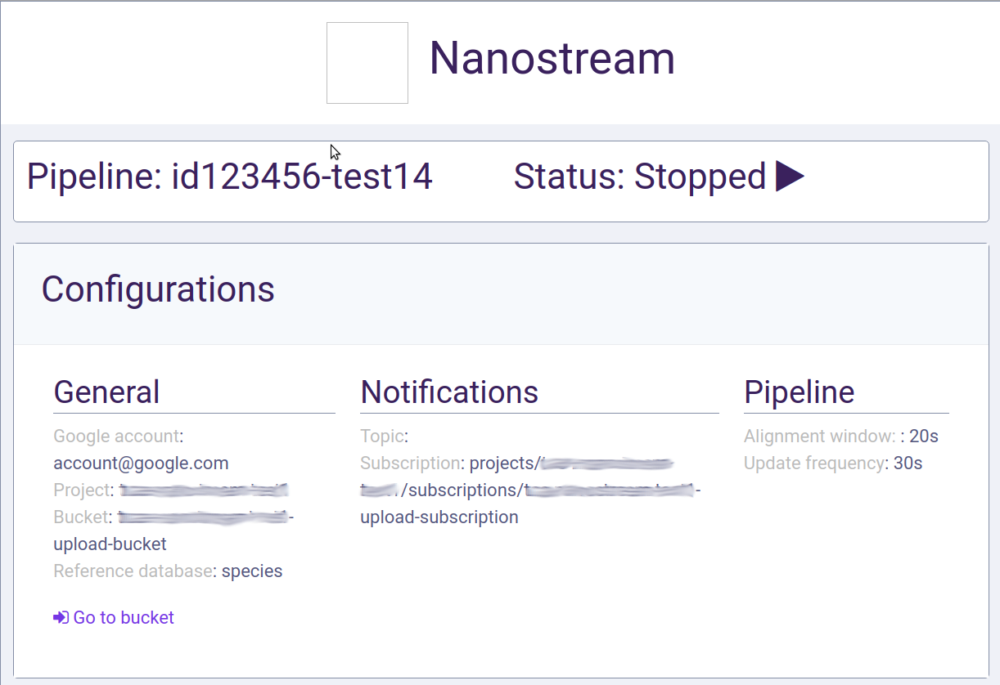

# Nanostream management application

Nanostream management application is designed to run/stop previously deployed dataflow templates.

You can access it by url: `https://<your project id>.appspot.com`

If there no jobs Start screen appeared.

 

Inputs:
- Pipeline name
- Collection name prefix - firestore database collection name prefix that will be used for results
- Document name prefix - firestore database document name prefix that will be used for results
- Reference database - choose on of predefined reference databases.
Here you just select processing mode that corresponds a reference database.


If there is a running job or job list is not empty you will see job screen:



By pressing a button next to status you can stop running dataflow.


When some data saved to Firestore database you can see them on a chart or a table:


Each input data folder corresponds a result file in a Firestore collection. You can choose it in a dropdown on a chart screen.   


## Reference database structure
You should upload reference database files to your reference database bucket created by install script (`gs://<your project id>-reference-db/`): 

```
gs://<your project id>-reference-db/
|- reference-sequences/
|-- antibiotic-resistance-genes/
|--- DB.fasta
|--- DB.fasta.[amb,ann,bwt,pac,sa]
|-- species/
|--- DB.fasta
|--- DB.fasta.[amb,ann,bwt,pac,sa]
```
For resistance genes mode you need resistance genes list too:  
```gs://<your project id>-reference-db/gene_info/resistance_genes_list.txt```
 
