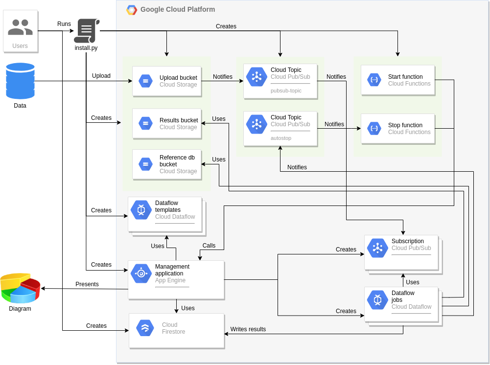

# Nanostream Dataflow

In a healthcare setting, being able to access data quickly is vital. For example, a sepsis patient’s survival rate decreases by 6% for every hour we fail to diagnose the species causing the infection and its antibiotic resistance profile.

Typical genomic analyses are too slow, taking weeks or months to complete. You transport DNA samples from the collection point to a centralized facility to be sequenced and analyzed in a batch process. Recently, nanopore DNA sequencers have become commercially available, such as those from Oxford Nanopore Technologies, streaming raw signal-level data as they are collected and providing immediate access to it. However, processing the data in real-time remains challenging,  requiring substantial compute and storage resources, as well as a dedicated bioinformatician. Not only is the process is too slow, it’s also failure-prone, expensive, and doesn’t scale.

This source repo contains a prototype implementation of a scalable, reliable, and cost effective end-to-end pipeline for fast DNA sequence analysis using Dataflow on Google Cloud.

## Design


### Project Structure
- NanostreamDataflowMain - Apache Beam app that provides all data transformations:
    - pipleline - Apache Beam pipeline lib
    - main - Console app that runs Apache Beam pipeline
    - webapp - GCP appengine application 
    - libs - Additional libs required for pipeline 
- launcher - installation scripts
- simulator - python script that can simulate file uploads to GCS (for testing, or if you don't have a real dataset)
- doc - additional documentation files 

### Application structure



### Setup

There is an installation script [install.py](launcher/install.py) that 
- creates required resources: 
    - A bucket for uploaded files
    - A bucket for dataflow templates
    - A bucket for reference database
    - A pubsub topic and for uploaded data
    - A pubsub topic, subscription, functions to start/stop dataflow templates
- deploys dataflow templates
- deploys [Nanostream management application](NanostreamDataflowMain/webapp/README.md)    


#### Requirements 

Before run automatic setup scripts or perform manual steps make sure you 
- created [Google Cloud Project](https://console.cloud.google.com); 
- linked billing account;
- Firestore used in [native mode](https://cloud.google.com/firestore/docs/firestore-or-datastore#in_native_mode) (use "nam5 (United States)" location).
- To run pipeline in `resistance_genes` mode you should provide "gene list" file stored in GCS. 
You can find sample file in `nanostream-dataflow-demo-data` bucket. See "Available Reference databases" section below.  


#### Setup using docker on Google Cloud Console

1. Open [Google Cloud Shell](https://ssh.cloud.google.com/)

2. Clone the project from Github

3. Set your Cloud Platform project in your session:  
```
gcloud config set project <your project id>
PROJECT_ID=`gcloud config get-value project`
```

4. Download a service account credentials to `~/.config/gcloud_keys/gcloud_credentials.json` JSON file: https://cloud.google.com/docs/authentication/production#obtaining_and_providing_service_account_credentials_manually.
You can do it from the shell as well:
```
gcloud iam service-accounts create nanostream
gcloud projects add-iam-policy-binding ${PROJECT_ID} --member "serviceAccount:nanostream@${PROJECT_ID}.iam.gserviceaccount.com" --role "roles/owner"
gcloud iam service-accounts keys create gcloud_credentials.json --iam-account nanostream@${PROJECT_ID}.iam.gserviceaccount.com
mkdir -p ~/.config/gcloud_keys/
mv gcloud_credentials.json ~/.config/gcloud_keys/gcloud_credentials.json
```
 
5. Build docker launcher
```
docker build -t launcher .
```

6. Run docker launcher
```
docker run \
  -v ~/.config/gcloud_keys/:/root/.config/gcloud_keys/ \
  -e GOOGLE_CLOUD_PROJECT=${PROJECT_ID} \
  -e GOOGLE_APPLICATION_CREDENTIALS=/root/.config/gcloud_keys/gcloud_credentials.json \
  launcher
``` 


7. Create a Cloud Firestore database: https://firebase.google.com/docs/firestore/quickstart#create

8. Upload Reference Databases to a place available to your project. You may use a bucket `gs://<your project id>-reference-db` created by [installation script](launcher/install.py). 

9. Open [Nanostream management application](NanostreamDataflowMain/webapp/README.md), create New Pipeline.   

10. Start upload your data to upload bucket (`gs://<your project id>-upload-bucket/<your folder data>`)
 

#### Setup using docker locally

Make sure you have installed
- [Docker](https://docs.docker.com/install/linux/docker-ce/ubuntu/) 
- [Google Cloud SDK](https://cloud.google.com/sdk/install)
 
1. Initialise Google Cloud SDK: https://cloud.google.com/sdk/docs/initializing
```
gcloud init

```
2. Get application-default credentials: https://cloud.google.com/sdk/gcloud/reference/auth/application-default/login
```
gcloud auth application-default login

```
3. Download a service account credentials to `~/.config/gcloud_keys/gcloud_credentials.json` JSON file: https://cloud.google.com/docs/authentication/production#obtaining_and_providing_service_account_credentials_manually
 
4. Clone the project from Github

5. Build docker launcher
```
docker build -t launcher .
```     

6. Run docker launcher
```
docker run \
  -v ~/.config/gcloud_keys/:/root/.config/gcloud_keys/ \
  -v ~/.config/gcloud/:/root/.config/gcloud/ \
  -e GOOGLE_CLOUD_PROJECT=<your project id> \
  -e GOOGLE_APPLICATION_CREDENTIALS=/root/.config/gcloud_keys/gcloud_credentials.json \
  launcher
``` 

#### Setup by running install.py directly

You can run installation script [install.py](launcher/install.py) directly.
 
Make sure you have installed: 
- [Python3](https://www.python.org/downloads/)
- [Maven](http://maven.apache.org/download.cgi)
- [Google Cloud Sdk](https://cloud.google.com/sdk/install)
- [Firebase Tools](https://firebase.google.com/docs/cli)
- [Node.js 10.x](https://nodejs.org/dist/latest-v10.x)

1. Init your gcloud configuration: `gcloud init`
2. Obtain a JSON file with a service account credentials (https://cloud.google.com/docs/authentication/production#obtaining_and_providing_service_account_credentials_manually).
3. Export GOOGLE_APPLICATION_CREDENTIALS environment var (https://cloud.google.com/docs/authentication/production#setting_the_environment_variable).
4. Run `python3 launcher/install.py`  
 

### Available Reference databases
For this project the bucket `nanostream-dataflow-demo-data` was created
with reference databases of species and antibiotic resistance genes.

The bucket has a structure like:
```
gs://nanostream-dataflow-demo-data/
|- reference-sequences/
|-- antibiotic-resistance-genes/
|--- DB.fasta
|--- DB.fasta.[amb,ann,bwt,pac,sa]
|-- species/
|--- DB.fasta
|--- DB.fasta.[amb,ann,bwt,pac,sa]
|-- taxonomy
|--- resistance_genes_tree.txt
|--- species_tree.txt
|-- gene-info
|--- resistance_genes_list.txt
```
where:
- DB.fasta - FASTA file with reference sequences
- DB.fasta.amb, DB.fasta.ann, DB.fasta.bwt, DB.fasta.pac, DB.fasta.sa - files generated and used by `bwa` in order to improve performance, see details in [this SEQanswers answer](http://seqanswers.com/forums/showpost.php?s=06f0dadc73bdf687f265a94c8217d0bd&p=90992&postcount=2)

**nanostream-dataflow-demo-data** - is a public bucket with [requester pays](https://cloud.google.com/storage/docs/requester-pays) option enabled.

You can copy these references to your project with:
```
gsutil -u <your project id> cp -r gs://nanostream-dataflow-demo-data/reference-sequences gs://<your project id>-reference-db/reference-sequences
```

Taxonomy files samples required to process data are in `taxonomy` folder:  
```
gsutil -u <your project id> cp -r gs://nanostream-dataflow-demo-data/taxonomy gs://<your project id>-reference-db/taxonomy
```

Resistance gene list required to run process data in `resistance_gene` mode.
Expected location is `gs://<your project id>-reference-db/gene_info/resistance_genes_list.txt`.
You can find a sample in `gene-info` folder:
 
```
gsutil -u <your project id> cp -r gs://nanostream-dataflow-demo-data/gene-info/resistance_genes_list.txt gs://<your project id>-reference-db/gene_info/resistance_genes_list.txt
```

### Pipeline template description
[Pipeline](NanostreamDataflowMain/pipeline/README.md)
